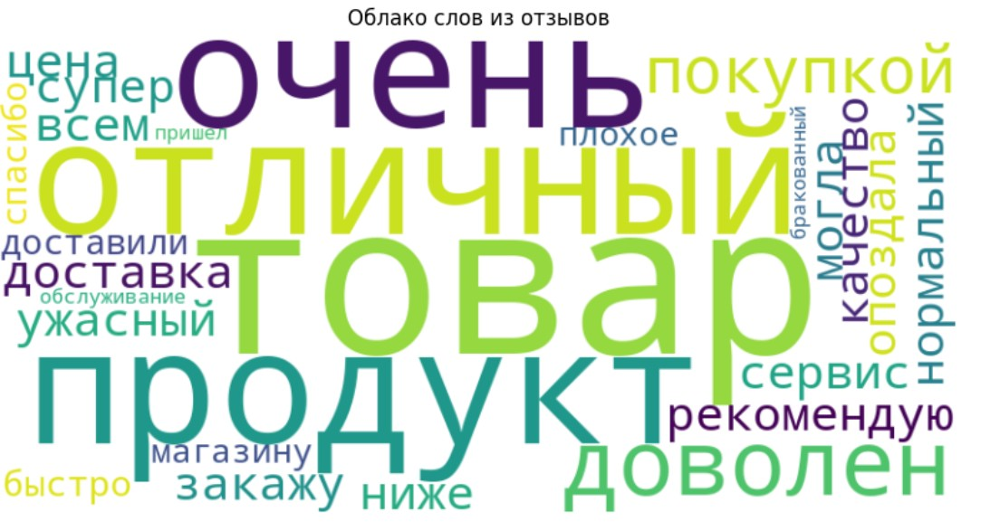

# LLM_Texts-Emotions

## 📝 Анализ популярности и тональности слов в отзывах
Добро пожаловать в проект "Анализ популярности слов в отзывах"! Этот проект создан для обработки текстовых отзывов на русском языке, подсчёта частоты слов, визуализации их в виде облака слов и анализа тональности. Всё это выполняется в Google Colab с использованием популярных Python-библиотек. 🚀

##🎯 Цель проекта
* 📋 Взять набор текстовых отзывов.
* 🔍 Подсчитать, какие слова встречаются чаще всего.
* ☁️ Построить красивое облако слов.
* 😊 Определить тональность каждого отзыва (позитивная, негативная, нейтральная).
* 🛠️ Используемые библиотеки

## Проект использует следующие Python-библиотеки:

* 📦 nltk — для токенизации текста (разбиения на слова) и работы со стоп-словами (например, "и", "не").
* 🌥️ wordcloud — для создания визуального облака слов, где размер слова зависит от его частоты.
* 🤖 transformers — для анализа тональности с помощью предобученной модели rubert-tiny-sentiment-balanced.
* 🎨 matplotlib — для отображения облака слов в виде графика.
* 🔧 re — для очистки текста от знаков препинания с помощью регулярных выражений.

